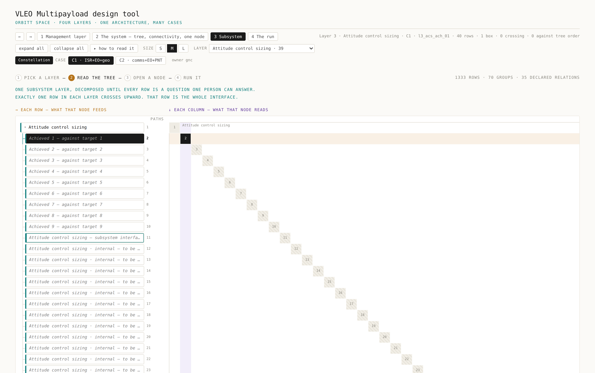

# VLEO Integrated Design Tool

A design tool for a very-low-Earth-orbit multipayload spacecraft with
air-breathing electric propulsion. One kernel computes every number in the
design; every page, panel, test and contract is generated from the same
declarations the kernel runs.

The subject is VLEO. The method is not specific to it.


## Status

Measured on `main`, 11 September 2026.

| | |
|---|---|
| rows in the tree | 1329 across four layers — 250 written, 1079 seeded |
| layer 1 · management | 174 rows, from CD-06 verbatim |
| layer 2 · the system | 319 rows, from CD-06 verbatim |
| layer 3 · subsystem | 836 rows across 17 subsystems |
| of the 250 written | 112 declared values · 126 computed · 12 KPI closures |
| declared edges | 463 derivation · 298 contribution · 177 relation |
| crates | 30 — 19 node crates, 11 engine and face crates |
| faces | browser · daemon · command line · C ABI · Python wheel · MATLAB |
| deepest declared chain | 25 nodes, solar flux to cost per year |
| 80-point sweep of the whole graph | 77–123 ms, three runs, release build |
| nodes past every machine check | 0 of 250 — see [Where it stands](#where-it-stands) |

---

## Running it

Rust 1.94.1, pinned in `rust-toolchain.toml`. No other runtime, no database, no
service to install.

```
git clone https://github.com/AmanRai0603/VLEO_SIMULATOR && cd VLEO_SIMULATOR
cargo run -p vleo-cli --bin vleo -- data sync     # fill the local store, once
cargo run --release -p vleo-daemon                # http://127.0.0.1:7777
```

The daemon serves the interface itself, on one origin. A page served from
elsewhere talking to a local program has to pass cross-origin rules,
mixed-content policy and private-network preflight; the last is tightening and
can break on a browser update with no change on this side. Serving both from one
process removes that boundary rather than negotiating it, and the tool works
with networking disabled.

### From the command line

```
vleo list prop                     # the rows in a subsystem
vleo show prop_capture_efficiency  # the sheet, as the engine holds it
vleo run prop_capture_efficiency   # evaluate it and everything it needs
vleo sweep prop_capture_efficiency --over prop_throat_area --from 0.005 --to 0.02
vleo campaign kpi_thrust_margin    # every stored case against one row
vleo cases                         # what each customer case supplies
vleo selftest                      # every fixture in the tree, this build
vleo data sync | list | verify     # the reference-data store
```

A run prints the number, the chain behind it, its credibility and what refused:

```
prop_capture_efficiency — Intake collection efficiency
  What fraction of the flow entering the mouth actually reaches the thruster?

  eta_c = 0.409091 -
  credibility 0 of 4, governed by validation

  15 ran, 0 blocked, 0 cycle sweep(s)

  provenance
    data   solar-drivers@2026.09.04#54784567db11b868
    kernel b29a9e · graph b3eb04 · case f56b9a · chain 93eca7
```

`n ran, m blocked` is always printed and the blocked rows are always named. A
row with no content yet returns `NotRun` under its own name rather than a
substituted default. The chain hash identifies the exact number: two runs with
the same chain hash are the same run.

`--set` applies only to rows whose number a person declared. On a computed row
it is refused by name, because a supplied value there would be overwritten the
moment the row is evaluated.

---

## What is in the repository

### Four rings, depending inward only

```
vleo-units  →  vleo-core  →  vleo-bus  →  vleo-mod-*  →  faces
RING 0         RING 1        RING 2       RING 3
quantities     physics       transport    the nodes     cli, daemon,
and portable   and the                                  wasm, ffi, py,
maths          relations                                matlab
```

`vleo-units` and `vleo-core` are `no_std`. Every relation lives in
`vleo-core::physics` and nowhere else; the gate fails the build if one appears
in a node.

### Four layers, one crossing each

| layer | holds | rows |
|---|---|---|
| 1 management | the programme's own view | 174 |
| 2 the system | what the spacecraft must do | 319 |
| 3 subsystem | seventeen of them | 836 |
| 4 the run | what a single evaluation produced | — |

Each subsystem reaches the layer above through exactly one `l3_*_interface`
row, and each customer reaches management through one row. A number can always
be traced upward without leaving the tree, and a change in one subsystem cannot
reach another by a side door.



### One node is one folder

```
crates/vleo-mod-prop/nodes/prop_capture_efficiency/
  node.toml      the sheet — the only file written by hand
  fixtures.toml  known-good values, with where each came from
  model.rs       generated, except inside numbered HOLE blocks
  contract.rs    generated — outputs, units, guarantees, domain, faults
  evidence.rs    generated — the fixture tests and three properties
  mod.rs         generated
  meta.json      generated
  page.html      generated — this node's fragment of the document
```

Nine generators: six per node, which read nothing but that node's sheet, and
three at assembly, which combine and refuse but never decide. A hand edit
outside a `HOLE` block is discarded by the next regeneration and fails the
regeneration diff.


---

## Developing

### Who does what

Nothing here is autonomous. The division is fixed and it is the point of the
whole arrangement: a person decides, a generator derives, an agent does the
part that is neither a decision nor a derivation.

| | does | cannot |
|---|---|---|
| **a person** | states the question, the relation, its source, the domain and the reason for each bound; derives the known-good numbers; accepts the node | be replaced at any of it — none of it is checkable by machine |
| **a generator** | emits every artefact from the sheet, deterministically | decide anything. It combines and refuses; a decision taken during generation is a decision nobody reviewed |
| **an agent** | drafts, fills a hole, writes a test, diagnoses a failure | do a person's part, and each is held out of it by a path rule rather than by instruction |

Two human decisions per node, and everything between them is a command. If a
node takes materially longer than that, the template has a defect worth finding
— it will be paid 1329 times.

### The nine generators

Six run per node. Each reads that node's sheet and nothing else, which is what
makes 1329 rows 1329 independent pieces of work rather than one large one.

| generator | emits | what it is for |
|---|---|---|
| model | `model.rs` | the whole implementation, with numbered `HOLE` blocks left open |
| contract | `contract.rs` | outputs, units, guarantees, domain, faults — what other nodes may rely on |
| module | `mod.rs` | wires the node into its crate |
| evidence | `evidence.rs` | the fixture tests, plus three properties derived from the declared domain |
| page | `page.html` | this node's fragment of the document |
| metadata | `meta.json` | criticality, reviewer count, open gaps |

Three run at assembly, where the whole tree is visible:

| generator | emits |
|---|---|
| index | the tree the faces read |
| document | every page fragment, assembled |
| graph | the three graph tables — derivation, contribution, relation |

The gap pass is the ninth and the cheapest: it diffs what the sheet promised
against what the artefacts contain. It costs nothing because the requirement is
a schema rather than prose, so it runs on every node on every build.

**What the generators mean in practice.** A sheet of about forty lines produces
six files and four tests. Structural correctness — units, guards, fault
construction, ordering, tracing — is inherited by every node at once and is
tested once, in the generator. What is left to write by hand is two or three
typed lines per hole, and those are what the five checks below surround.

### The loop, start to finish

Verified end to end on `main`: a node taken from nothing to "waiting on a
person", then removed.

```
cargo run -p xtask -- new <id> --like <sibling>   # clone the shape, blank the decisions
cargo run -p xtask -- declare <id>                # the completion questions, and which are open
#   a person answers them in node.toml
cargo run -p xtask -- docs <id>                   # refuses while any is open; then six artefacts
cargo run -p xtask -- fill <id> --hole 1 --body - # the hole body arrives as text, and is spliced
cargo run -p xtask -- gate <id>                   # twelve checks, in order
cargo run -p xtask -- ready <id>                  # has it earned a person's attention
cargo test -p vleo-mod-<subsystem>
```

What that run showed, in order:

| stage | what happened |
|---|---|
| `declare` | six questions open |
| `docs` | refused, named the six fields, wrote nothing |
| `declare` | `0 gaps open · ready to generate` |
| `docs` | six artefacts written |
| `fill` | one line spliced; a second body carrying a guard was refused by name |
| `gate` | twelve checks, then `0 node check failure(s)` |
| `ready` | held — no fixture yet |
| a fixture added | `1 of 1 waiting on H2`, and four tests generated for it |

The gate also caught a real defect during that run: a bulk edit had clobbered
the inherited input types, and the contract check named every one of them —
"`eta_geo` expects Area but `prop_eta_geo` publishes Ratio". That is an
interface mismatch caught at the sheet, before any code existed.

Two commands must be green before anything is pushed:

```
cargo run -p xtask -- gate && cargo test
```

### The seven agents

Definitions in `.claude/agents/`, lanes in `agents/lanes.toml`, provenance and
model choice in `agents/provenance.toml`. Each is defined by what it cannot
change, checked against the diff rather than asserted in its prompt:

```
tools/agent_lanes.py --agent <name> --since HEAD~1
```

| agent | does | may not | enforced |
|---|---|---|---|
| A declaration-drafter | drafts a sheet from a source, raises what must be answered | supply mathematics, a reason or a value | partial |
| B fixture-recorder | records values a person derived, with provenance | produce an expected value | partial |
| C hole-filler | returns the body of one numbered hole, as text | write outside the hole; add a guard | full |
| E test-author | turns a stated property into a test | invent an expected value | partial |
| F diagnostician | gathers evidence when something moved | fix, or judge acceptability | partial |
| I systems-backend | generators, gate, kernel plumbing, the faces | edit a sheet or a hole | full |
| J frontend-visualisation | the web face, panels and figures | invent a style token; ship an unrendered figure | partial |

**Where each sits in the loop.** A is before `declare`, reading a paper into
sheet fields. B is after a person has derived a known-good number, formatting it
with its provenance. C is between `docs` and `fill`, returning the hole body as
text. E extends the evidence beyond the three generated properties. F is not in
the loop at all — it runs when something moved and nobody expected it. I and J
work on the tool rather than on the design.

`full` means the machine prevents it. C has no write tool at all: it returns
hole bodies as text and `xtask fill` is the only route into a generated file,
refusing a guard, an early return or a platform maths call before anything is
written.

`partial` and the grades behind it are recorded per lane, with what holds and
what does not. Agent A cannot be stopped from inventing a formula; a relation
with nobody's name against it is a gap that blocks review, which is the closest
mechanical thing to it. Whether the formula is right is H1b's job and will not
become a machine's.

Four of the seven have never fired here, and that is recorded rather than left
to be noticed: `agents/provenance.toml` gives each an `expected_from` — the
point in the work at which it starts — and `tools/fleet_report.py` reads it, so
an agent silent *before* its own `expected_from` is one waiting for work that
has not begun, and one silent *past* it is a finding.

Five roster entries are scripts rather than agents, because the work is a fixed
transform with one right answer: the commit-message rule
(`tools/commit_message.py`), the advisory review (`tools/review_report.py`,
which can never block a merge), the dependency bot (`.github/dependabot.yml`),
bundle publication (`xtask bundle publish`), and the release pipeline with one
human approval. A model is the wrong tool for work with no judgement in it.

### What runs without being asked

| when | what |
|---|---|
| a session opens | tree state, what is blocking, whether reference data is present |
| a sheet or fixture is saved | the gate on that node |
| a commit message is written | its form, by the same script the pipeline runs |
| every push | build, regenerate, gate, test, both profiles, no-std, panels |
| every push | an advisory review that cannot fail the build |
| every night | six passes over the whole tree, the ledger and yesterday's state |
| weekly | a dependency bot on its own branch, fourteen-day minimum age, no majors |
| on a tag | prove, build, then one human approval |

### Panels

A figure that renders perfectly can still be false, and the recorded defects in
this codebase are of that kind. Each declared panel in `panels/` carries what it
draws, which state it reads, and what a correct picture looks like. Three checks
run in a real browser against the real daemon:

```
python3 tools/panel_check.py
```

It renders · it moves when each declared input moves · it matches a stored
reference. The second is the one that matters: a panel wired to nothing renders
perfectly and matches yesterday's reference every time.

---

## Design rules

These are the rules everything else is derived from. Each is enforced
mechanically, not by convention.

| rule | mechanism |
|---|---|
| A unit is a type | adding a `Millinewton` to a `Newton` does not compile |
| An interface is a node, not a meeting | if it is not on a sheet it does not exist |
| A guard carries the reason it exists | the reason is a required field; a guard without one is generated with it or not at all |
| An expected value may never come from the code under test | the gate refuses a fixture whose provenance is `self-snapshot` or `agent-generated` |
| A refusal is never a substitution | a blocked row is named; a sweep records refused points |
| The same sheet gives the same bytes | the regeneration diff and a byte-stability check on every push |

Two consequences worth stating because they are unusual:

**The cache key is the chain hash, not the case hash.** A case hash would return
a stale number the moment an input below it changed.

**Transcendentals go through `pmath`, never the standard library.** Sine,
cosine, exponential and power differ in the last bit between a native build and
a WebAssembly one. The kernel crates are `no_std`, so `f64::cos` does not exist
there and the compiler refuses it; in a hole body the splice and then the gate
refuse it by name. Without this, bit-for-bit agreement across the faces is not
achievable and the nightly check becomes one people learn to ignore.

---

## Where it stands

The tree is built and mostly empty, which is the state it is designed to be
useful in. 250 rows of 1329 have content. `xtask ready` reports what is holding
the rest:

```
250  the relation has nobody's name against it
120  no fixture — nothing outside this code has agreed with it
```

Every relation currently in the tree came from transcribing CD-06 or from
building the scaffolding. None has been through a physics review, and the tool
says so rather than reporting rows as ready.

Three rows refuse at the reference case, and each refusal is a declared limit
working:

| row | the refusal, as printed |
|---|---|
| `aero_ao_fluence` | `F_AO = 2.02e27` is above the declared upper limit of `1e26` — "above 1e26 atoms per square metre no known external material survives, so the design is not a design" |
| `pay_geolocation_error` | `e_geo = 0.00477 m` is below the declared lower limit of `0.01 m` — "below a centimetre no time-difference system in this design performs that well" |
| `kpi_geolocation` | blocked, because the row above it refused. A KPI whose input did not run is unknown, and says so |

Each prints `n ran, m blocked` with the blocked row named and the bound, the
value and the reason beside it.

Thrust-to-drag does not close at this design point. The tool reports that rather
than being tuned until it does.


---

## What this is not

- **Not validated.** No relation has been through a physics review. Credibility
  is reported per run and is currently governed by validation for every row.
- **Not a trajectory propagator.** Nothing here propagates an orbit, converts
  between frames or forms a state transition matrix. `ADOPTION.lock` names the
  libraries to adopt on the first node that needs one, and why they are not
  dependencies yet.
- **Not a multi-user service.** One local daemon, one store, no accounts.
- **No differential fill and no mutation testing in the pipeline.** Both are
  named in the working model; the sheet carries the flag and the runner does not
  exist. Mutation testing has been done by hand and recorded per change.
- **Signing is absent, not stubbed.** The release workflow builds and gates but
  does not sign, because no certificate exists yet.
- **Two faces sit outside the workspace.** `vleo-wasm` and `vleo-py` need
  targets of their own, so `cargo build --workspace` does not reach them. They
  have their own pipeline job; build them by hand from their own directories.

## Two things a fresh clone needs from a person

1. `git config core.hooksPath tools/githooks` — the commit-message hook. A
   session opened through the authoring tool sets this itself.
2. A GitHub environment named `release` with required reviewers. Until it
   exists the release approval passes instantly, and nothing in this repository
   can create it.

---

## Reference

| | |
|---|---|
| [`docs/USING_IT.md`](docs/USING_IT.md) | the page to read first — running it, filling a row, what each agent will and will not do |
| [`docs/ARCHITECTURE.md`](docs/ARCHITECTURE.md) | why the rings are shaped the way they are |
| [`docs/NODE_AUTHORING.md`](docs/NODE_AUTHORING.md) | the sheet, field by field |
| [`docs/WORK_MODEL.md`](docs/WORK_MODEL.md) | who decides what, and which changes need two reviewers |
| [`docs/AGENT_EVIDENCE.md`](docs/AGENT_EVIDENCE.md) | what each agent produced when it was first used here |
| [`docs/VARIABLES.md`](docs/VARIABLES.md) | every variable, unit, bound and the reason for it — generated |
| [`docs/RUNBOOK.md`](docs/RUNBOOK.md) | what to do when the tool is down |
| [`ADOPTION.lock`](ADOPTION.lock) | every external dependency, its licence, its fallback and when it was last checked |

## Provenance

The design rules trace to two loss-of-mission investigations. In 1999 a
spacecraft was lost because ground software supplied impulse in pound-force
seconds and navigation expected newton seconds; the interface belonged to both
sides and was owned by neither. In 1996 Ariane 501 flew a component with a
flawless record on the previous vehicle outside the envelope it was specified
for, and nothing was re-derived. Both boards reached past the immediate fault,
and neither concluded that somebody should have been more careful. The rules
above are what that conclusion looks like when it is made mechanical.
