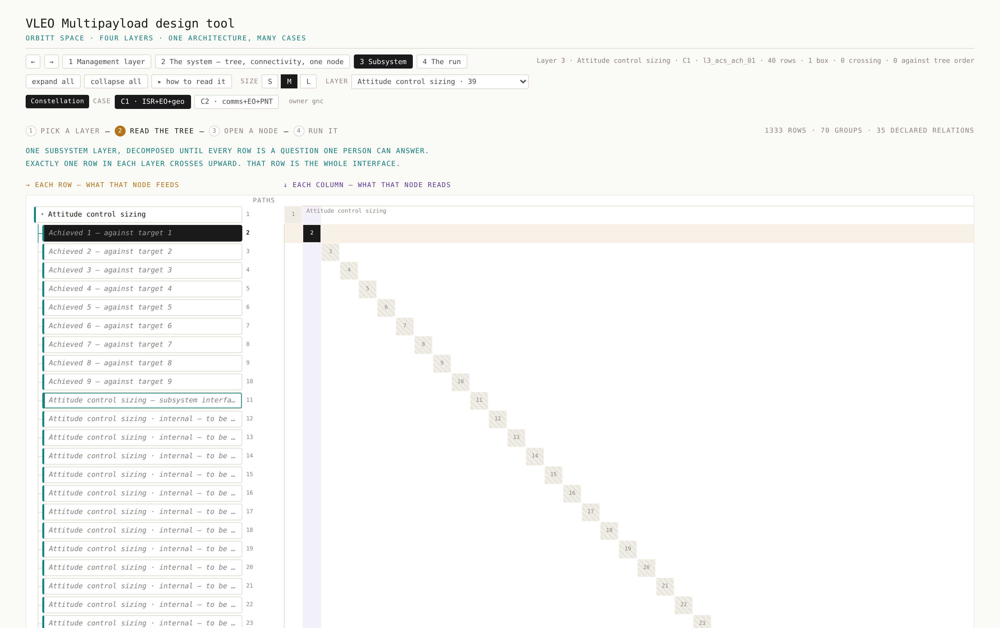

# VLEO Integrated Design Tool

> **Answer first.** A design tool for a very-low-Earth-orbit multipayload spacecraft: one kernel computes every number, a team runs it on its own inputs and asks for changes through node forms, each change is previewed and approved by the person who asked for it, and only then released to everyone. Start the tool with `cargo run --release -p vleo-daemon` and press ? Manual.
>
> **Kind:** explanation + reference · **For:** everyone

A design tool for a very-low-Earth-orbit multipayload spacecraft with
air-breathing electric propulsion. One kernel computes every number in the
design; every page, panel, test and contract is generated from the same
declarations the kernel runs.

The subject is VLEO. The method is not specific to it.


## Who does what

Three roles around one loop. Each has its own guide — an interactive page,
generated from the tool's manual, that opens with the role and then carries
every step and command for it:

| role | does | guide |
|---|---|---|
| **user** | uses the tool; fills a node form when a node is wrong or missing; tries the preview of the change and approves it | [`docs/roles/user.html`](docs/roles/user.html) |
| **maintainer** | takes each form in, sends the preview, records the approval, merges, releases, shares — every step one command | [`docs/roles/maintainer.html`](docs/roles/maintainer.html) |
| **developer** | writes what the routine cannot: kernel relations, filled holes, checks, the tool itself | [`docs/roles/developer.html`](docs/roles/developer.html) |

    user fills a node form ──▶ take ──▶ preview ──▶ user tries it, approves ──▶ approve ──▶ merge ──▶ ship
                               └─ each form on its own branch, form/<author>/<node>; main holds approved work only

The five commands — `take`, `preview`, `approve`, `queue`, `ship` — are
`cargo run -p xtask -- <command>`; the maintainer's guide walks one form from
arrival to release. Nothing reaches `main` without its author's approval of the
exact build they tried, and the pipeline checks that on every form branch.

**A node's relation arrives three ways, and each checks the other two.** Its
author's own code — MATLAB, Python, anything — produced their test cases; the
*method* says the same relation in a small fixed language the tool can check
for units and run ([`docs/PSEUDOCODE.md`](docs/PSEUDOCODE.md)); and the code the
tool ships is translated from the method by fixed rules. The form runs the
method on the author's cases as they type; `take` builds the node stage by
stage (`build-node`) and connects it to the design only once every case agrees.
`migration` lists the rows still without a method, by owner.

## Status

Measured on `main`, 26 September 2026. Every figure here is produced by a
command in this repository, named beside it where it is not obvious. The tool's
own manual shows the live counts for the copy you are running.

| | |
|---|---|
| rows in the tree | 1396 across four layers — 320 written, 1076 seeded (`xtask status`) |
| layer 1 · management | 174 rows, from CD-06 |
| layer 2 · the system | 321 rows, from CD-06 |
| layer 3 · subsystem | 901 rows in 18 groups — 16 subsystems and 2 additions |
| of the 320 written | 130 declared values · 172 computed · 12 KPI closures · 1 requirement · 5 achieved |
| of the 320 written, which answer | 176 answer · 137 do not yet, because the relation is stated and never derived · 7 retired (`xtask active`) |
| declared edges | 555 derivation · 298 contribution · 179 relation (`xtask graph`) |
| crates | 32 — 20 node crates, 12 engine, server and face crates |
| faces | browser · daemon · command line · C ABI · Python wheel · MATLAB |
| deepest declared chain | 33 nodes, mission duration to cost per year — declared, not yet runnable end to end |
| 80-point sweep through the daemon | 36–37 ms, three runs, release build — the sustained solar closure against launch date. A sweep of thrust-to-drag or of cost per year answers none of its points today, and records every refusal |
| nodes past every machine check | 16 of 320, waiting on a person — see [Where it stands](#where-it-stands) |
| declared panels | 14 — 3 structural, 11 solar-weather. 8 are matched against stored pictures, light and dark; none of the 11 solar panels has been signed by a person yet (`panels/REVIEW.md`) |

---

## Running it

Rust 1.94.1, pinned in `rust-toolchain.toml`. No other runtime, no database, no
service to install.

```
git clone https://github.com/AmanRai0603/VLEO_SIMULATOR && cd VLEO_SIMULATOR
cargo run -p vleo-cli --bin vleo -- data sync     # fill the local store, once
cargo run --release -p vleo-daemon                # http://127.0.0.1:7777
```

The daemon serves the interface itself, on one origin. A page served from
elsewhere talking to a local program has to pass cross-origin rules,
mixed-content policy and private-network preflight; the last is tightening and
can break on a browser update with no change on this side. Serving both from one
process removes that boundary rather than negotiating it, and the tool works
with networking disabled.

It binds `127.0.0.1` and takes the first free port from 7777 upward, printing
the one it got. Set `VLEO_PORT` to pin it.

**The tool carries its own manual.** Press **? Manual** at the top of the page,
or open `/#manual` (a single section is `/#manual/<section>`, such as
`/#manual/term-run`). It covers the browser and the terminal, can be filtered
to what a user does or what a developer does, and lists what cannot be done by
hand with why and what to do instead. Every command has a copy button. A card
at its top says where this copy keeps the case and the results, and whether a
case is saved. Its source is `docs/manual.toml`, and it is tested
against the code: `cargo test` fails on a command, route, variable, folder or
button it names that does not exist, or one the code has that it leaves out,
and the pipeline runs every command it calls safe, exactly as written.

**The tool never writes the repository.** The team using it sets the inputs,
runs, and keeps results — all of it outside the checkout, under `~/.vleo/` —
and asks for the design to change through a node's form, which the developers
check, apply and release. There is no edit mode to turn on: a node cannot be
changed, added or removed from the browser.

**The team does not need this repository.** `cargo run -p xtask -- kit` builds a
folder with the two programs beside exactly the files they read, and
`START_HERE.md` on top; the release pipeline attaches one per platform. Zip it,
share it, and take back the node forms it hands out —
[`docs/SHARING.md`](docs/SHARING.md) is the loop, and
[`docs/TEAM_GUIDE.md`](docs/TEAM_GUIDE.md) is what the team reads.

To change an input and watch the answer move —
[`docs/USING_IT.md` §2b](docs/USING_IT.md) drives it end to end on the solar
rows: only declared numbers can be set, the tool refuses a computed one by
name, and moving the launch date from 2027 to late 2032 takes the design flux
from 200.14 to 258.23 sfu and cuts the sustained F10.7 closure's margin from 60
to 38 per cent.

### In a Codespace, or any devcontainer

**There is nothing to type.** `.devcontainer/` pins the toolchain, fills the
reference-data store, regenerates the per-node artefacts and builds the daemon
when the container is created; attaching to it starts the daemon if nothing is
already serving. Port 7777 is forwarded and opens a preview, so the first tab a
new Codespace shows you is the tool.

To run it yourself instead — after stopping the one that started, or on a
machine with no devcontainer:

```
cargo run --release -p vleo-daemon
```

Nothing about the tool is different there. It is the same single process
serving the same one origin, which is the point of it having no database and no
service to install. The reference-data store is kept under `$HOME`, outside the
checkout, so running the tool never makes the working tree look dirty.

### From the command line

Written here as `vleo`. From a checkout it is
`cargo run -p vleo-cli --bin vleo -- …`, or `cargo vleo …` for short.

```
vleo list solar                    # the rows in a subsystem
vleo show sw_ap_design             # the sheet, as the engine holds it
vleo run sw_ap_design              # evaluate it and everything it needs
vleo sweep sw_ap_design --over sw_storm_design_level --from 1 --to 3 --points 3
vleo run sw_ap_design --inputs cases/examples/storm_level_2.csv   # on a case file
vleo campaign sw_ap_design --inputs cases/examples/storm_level_2.csv
                                   # defaults, the saved case and each file, side by side
vleo cases                         # the case, and how its inputs divide
vleo inputs                        # every input as a CSV to fill in
vleo selftest                      # every fixture declaration in the tree is sound
vleo data sync | list | verify     # the reference-data store
```

A run prints the number, the chain behind it, its credibility and what refused:

```
sw_ap_design — Ap design value
  What daily Ap is this design built to survive?
  inputs: the declared defaults

  Ap_design = 132.000 -
  credibility 1 of 4, governed by mathematics

  2 ran, 0 blocked, 0 cycle sweep(s)

  provenance
    data   solar-drivers@2026.09.04#54784567db11b868 · solar-weather@2026.09.14#f3557eb8443bfdaa
    kernel 1ad1ae · graph adb684 · case 1f25f9 · chain 075c5d
    mode branch · endpoint local-cli
```

**There is one case, and what changes is its inputs.** A customer, or the sky
a design must survive, is a set of input values — not a folder, and never a
commit. The **Inputs** page lists all 128 in two halves: the **condition** the
design flies in (orbit, environment, solar weather) and everything the
**customer** chooses. Set them there or upload a CSV; the tool checks every row
against its declared range, refuses a file with any bad row whole, and saves
the case **outside the repository** (`~/.vleo/case/`, or `VLEO_CASE`), so git
never sees it. Every run, sweep and figure is then on that case. From a terminal
the same file runs with `--inputs <file.csv>`, `--defaults` runs the design as
declared, and `--set` has the last word.

**An update does not strand a case.** Every CSV the tool writes names the set of
inputs it was written for (`#! template`). When the tree gains, retires or
re-ranges an input, an older case is carried over rather than refused: values
that still apply are kept, new inputs take their defaults, and anything that can
no longer be used is set aside by name, with its value, in the file itself. The
saved case is carried over the first time the updated tool reads it, with the
old file kept beside it, and the Inputs page says what changed.

**Three things go out to people who do not have a checkout, and come back.**
The **Forms** tab has all three in one place.

| form | who fills it | what it changes | applied by |
|---|---|---|---|
| the case CSV — *Inputs* | anyone using the tool | the values a run is on | the tool itself, on upload; never git |
| a result — its folder, its CSV, or its HTML report | saved from a run or a sweep | nothing: it is a record of what a run returned and the inputs it ran on | the tool, on the *Results* tab — shown without running |
| a node's form — one HTML file per node, or per new node | whoever should say what that node is | the node's sheet: its question, relation, bounds, steps, assumptions — or a new node in its place in the tree | a developer, `xtask intake <file> --apply`, then git and a release |

**A result is kept, sent and seen again without running.** Save one after a run
or a sweep (*save this result* or *save this sweep* in the browser, `vleo run …
--keep` in a terminal) and the tool keeps a folder — every value returned, every
row blocked, every input it ran on, the sweep's points, and a report page — in
`~/.vleo/results/` or wherever `VLEO_RESULTS` points. **A question already kept
is not run again:** the same row, inputs, engine and data is shown from its saved
result, which the page names, and saved once. The *Results* tab lists them,
shows any of them as it was — sweeps drawn again from their points — compares
two, downloads the report page that reads without the tool and uploads back
whole, and can make a result's inputs the case again. `vleo result <folder>` does
the same from a terminal.

A node's form is downloaded from the node's page or the Forms tab (or
`xtask form <node>`; `xtask form --new` for a node the design does not have
yet, which also asks where it goes). It is self-contained: it needs no connection, explains every question and why it is
asked, shows what the node reads and feeds and the known values that hold it,
and saves a filled copy of itself. It can be filled by hand or by an assistant —
the content is a plain TOML block. The tool only *checks* a returned form; the
developer's `intake` compares three versions (the node when the form was made,
the form, the node now), so a change made meanwhile is a conflict rather than
overwritten, and a relation an assistant supplied is refused. It checks every
interface the form declares — each input a row that exists, of the quantity the
node expects — and for a new node, that the id is free and the parent a group.
The next release carries what was applied, and the people who filled it run it
with their own inputs. `docs/examples/` has a filled node form, a filled
new-node form and a saved result.

`n ran, m blocked` is always printed and the blocked rows are always named. A
row with no content yet returns `NotRun` under its own name rather than a
substituted default. So does a written row whose relation is stated but has
never been derived, and the run prints `INACTIVE — the relation is stated and
never derived` with what the sheet still needs. The chain hash identifies the exact number: two runs with
the same chain hash are the same run.

`--set` applies only to rows whose number a person declared. On a computed row
it is refused by name, because a supplied value there would be overwritten the
moment the row is evaluated.

---

## What is in the repository

### Every top-level folder, and what breaks without it

| folder | what it holds | why it is here |
|---|---|---|
| `crates/` | the whole Rust workspace: the four rings, the faces, and **1396 node folders** under `crates/vleo-mod-*/nodes/` | this is the tool. Almost every file in the repository is here, and most of those are the per-node artefacts `xtask docs` writes from a sheet |
| `layers/` | the rows in the tree that are **not** nodes — headings, parents, group edges, subsystem ownership | the decomposition itself. `CODEOWNERS` is generated from it, so moving a branch here moves who reviews what |
| `tools/` | the Python side: the seeder that built the tree, and every check the pipeline runs that is not `cargo` | the checks that cannot be expressed as a Rust test — screenshots, parity against MATLAB, commit messages, the house rules' own references. Each proves itself with `--selftest` before it is trusted to decide anything |
| `web/` | the browser face — one `index.html`, one stylesheet, 23 ES modules, the manual among them | how the tool is read. It talks to `vleo-daemon` over HTTP and holds no physics of its own |
| `panels/` | 14 declared panel specs, plus `REVIEW.md` and 16 reference screenshots — light and dark for the 8 panels checked on pixels | a figure nobody checked is a figure that silently goes wrong. The spec says what the panel must show; the references are what it looked like when a person last approved it |
| `docs/` | 15 prose documents — two of them generated from the sheets, VARIABLES.md and the de-risking narrative — 4 diagrams, `manual.toml` — the source of the manual in the tool — and `examples/`, two filled node forms and a saved result; indexed under **Reference** below | the written record. `VARIABLES.md` is generated; `MATLAB_PORT_PLAN.md` is the row-by-row account of the port and the longest thing here |
| `bundles/` | reference data as published sets, each with a manifest, a licence term and a hash | rule 2's external oracle. An expected value may never come from the code under test, so the data it is checked against is versioned and verified rather than fetched |
| `cases/` | the one case, `multipayload.toml` — which inputs are the condition, and so which are the customer's — and `examples/`, case files to copy — one as an older tool wrote it | what a run is on. Its values are not kept here: a case per customer would grow the tree with the order book, so values are uploaded or typed in the tool and saved outside the repository. Gate check V16 refuses a condition that is not a real, settable input |
| `matlab/` | a thin MATLAB face (`+vleo`) and the study's own published CSV | the tool this was ported from. Its saved run is what `tools/mat_parity.py` compares against |
| `sources/` | every citation as an object with an id, not as free text | a fixture references `jacchia1971`, never a sentence. Marking a source superseded then lists every row that depended on it, in one query |
| `cd06/` | `tree.json` — the CD-06 planning document's own node tree, extracted verbatim | where the 1396 rows came from. `tools/seed_tree.py` reads it, so the tree's shape is traceable to the document rather than asserted |
| `areas/` | six area files that narrow `AGENTS.md` per area | the nearer file wins, so an area can be stricter than the root without restating it |
| `xtask/` | the task runner — `intake`, `publish`, `gate`, `docs`, `assemble`, `fill`, `ready`, `status` and the rest | the one entry point for everything generated or checked. `cargo run -p xtask -- gate && cargo test` is the command that must be green |
| `.claude/` | four hooks | what fires on an edit made in an assistant's session — the same regeneration and gate anyone's edit goes through |
| `.github/` | the pipeline (`gate.yml`, `nightly.yml`), the dependency bot, the PR template | eight jobs, and the regeneration diff that catches a generated file nobody re-ran |
| `.devcontainer/` | the Codespace definition and its setup scripts | a fresh clone that runs without a person installing anything |
| `.cargo/` | two command aliases: `cargo xtask …` and `cargo vleo …` | short forms of `cargo run -p xtask -- …` and `cargo run -p vleo-cli --bin vleo -- …`. The manual writes out the long forms, and both work in any checkout |
| `target/`, `generated/`, `.vleo/` | build output, assembled fragments, the local data store | all three are generated and all three are git-ignored. Nothing here is a source |

### Four rings, depending inward only

```
vleo-units  →  vleo-core  →  vleo-bus  →  vleo-mod-*  →  faces
RING 0         RING 1        RING 2       RING 3
quantities     physics       transport    the nodes     cli, daemon,
and portable   and the                                  wasm, ffi, py,
maths          relations                                matlab
```

`vleo-units` and `vleo-core` are `no_std`. Every relation lives in
`vleo-core::physics` and nowhere else; the gate fails the build if one appears
in a node.

### Four layers, one crossing each

| layer | holds | rows |
|---|---|---|
| 1 management | the programme's own view | 174 |
| 2 the system | what the spacecraft must do | 321 |
| 3 subsystem | sixteen subsystems and two additions | 901 |
| 4 the run | what a single evaluation produced | — |

Each subsystem reaches the layer above through exactly one `l3_*_interface`
row, and each customer reaches management through one row. A number can always
be traced upward without leaving the tree, and a change in one subsystem cannot
reach another by a side door.



### One node is one folder

```
crates/vleo-mod-prop/nodes/prop_capture_efficiency/
  node.toml      the sheet — the only file written by hand
  fixtures.toml  known-good values, with where each came from
  model.rs       generated, except inside numbered HOLE blocks
  contract.rs    generated — outputs, units, guarantees, domain, faults
  evidence.rs    generated — the fixture tests and three properties
  mod.rs         generated
  meta.json      generated
```

The node's page is not a file in the folder: the engine renders it from the
sheet when it is opened.

Nine generators: six per node, which read nothing but that node's sheet, and
three at assembly, which combine and refuse but never decide. A hand edit
outside a `HOLE` block is discarded by the next regeneration and fails the
regeneration diff.


Eleven tabs, under an **Answer first** box, and each says what kind of reading
it is — explanation, reference, or something to try. The first reads the row
the way `docs/EXPLAINING.md` lays out every explanation: said simply, the real
thing with its source, where the simple version breaks, the common wrong idea,
try it. **De-risking** says what the row rests on and every version before it.
Two of the tabs are derived rather than written. **Pseudocode** is
built from the sheet and not from the Rust, so it states what was specified
rather than what one compiler made of it. **The relation, moving** animates the
node's own relation across its declared domain, drawing the engine's sweep so a
picture that disagrees with the node is impossible; the guards appear as the
walls they are, labelled with what they refuse, and where the engine refuses a
point the line breaks and the refusal is counted. A **theory** tab sits beside
them for prose a person writes: why this relation is the relation, derived a
line at a time, and what the answer does not mean.

---

## Developing

### Who does what

Nothing here is autonomous, and the line that matters is between the people who
**use** the tool and the people who **maintain** it.

| | does | cannot |
|---|---|---|
| **the team** | sets the inputs, runs, keeps and sends results; fills a node's form — or a new node's — when the design should change | change the design from the tool. A form is a request, with a record of who asked and why |
| **a developer** | checks each form (`xtask intake`), applies it in its layer, publishes, implements the holes, records evidence, gates, releases | apply a form the checker has not passed, or overwrite a change made since the form was drawn |
| **a person** — either side | states the question, the relation, its source, the domain and the reason for each bound; derives the known-good numbers; accepts the node | be replaced at any of it — none of it is checkable by machine |
| **a generator** | emits every artefact from the sheet, deterministically | decide anything. It combines and refuses; a decision taken during generation is a decision nobody reviewed |
| **an assistant** | whatever a developer runs it for — a hole body (`fill --by --model` records it), ordinary engineering on the tool | supply a relation: intake refuses a form whose relation an assistant filled, and relation stamping refuses an assistant's name |

Two human decisions per node, and everything between them is a command. If a
node takes materially longer than that, the template has a defect worth finding
— it will be paid 1396 times.

### The nine generators

Six run per node. Each reads that node's sheet and nothing else, which is what
makes 1396 rows 1396 independent pieces of work rather than one large one.

| generator | emits | what it is for |
|---|---|---|
| model | `model.rs` | the whole implementation, with numbered `HOLE` blocks left open — or, for a node with a method, the call to its method translated into `vleo-core::physics::methods` |
| contract | `contract.rs` | outputs, units, guarantees, domain, faults — what other nodes may rely on |
| module | `mod.rs` | wires the node into its crate |
| evidence | `evidence.rs` | the fixture tests, plus three properties derived from the declared domain |
| page | — | this node's fragment of the document, rendered from the sheet when it is opened; never written to the folder |
| metadata | `meta.json` | criticality, reviewer count, open gaps |

Three run at assembly, where the whole tree is visible:

| generator | emits |
|---|---|
| index | the tree the faces read |
| document | every page fragment, assembled |
| graph | the three graph tables — derivation, contribution, relation |

The gap pass is the ninth and the cheapest: it diffs what the sheet promised
against what the artefacts contain. It costs nothing because the requirement is
a schema rather than prose, so it runs on every node on every build.

**What the generators mean in practice.** A sheet of about forty lines produces
six files and four tests. Structural correctness — units, guards, fault
construction, ordering, tracing — is inherited by every node at once and is
tested once, in the generator. What is left to write by hand is two or three
typed lines per hole, and those are what the five checks below surround.

### The loop, start to finish

A form arrives; a developer takes it to a release:

```
cargo run -p xtask -- intake <form.html>          # the checker: changes, interfaces, conflicts — writes nothing
cargo run -p xtask -- intake <form.html> --apply  # into its layer; a new node is built in its place
cargo run -p xtask -- publish <id>                # seeded and filled → published; the code is generated
cargo run -p xtask -- fill <id> --hole 1 --body - --by "<who>" --model <model>
cargo run -p xtask -- gate <id>                   # the checks, in order
cargo run -p xtask -- ready <id>                  # has it earned a person's attention
cargo test -p vleo-mod-<subsystem>
```

then a commit naming whoever filled the form, review, merge, and a release —
`cargo run -p xtask -- release <version>` stamps every node version recorded
since the last one, and `cargo run -p xtask -- derisk` regenerates the
de-risking narrative. A change that moves what a node computes carries its
reason — which belief broke — and becomes a numbered version of that node; see
[`docs/DERISKING.md`](docs/DERISKING.md). Every page, form, result and document
follows [`docs/EXPLAINING.md`](docs/EXPLAINING.md): answer first, said simply,
the real thing, where it breaks.

Before forms, the same loop was verified end to end on `main` from the other
end — a node taken from nothing to "waiting on a person" with `xtask new` and
`declare`, then removed. `xtask new` still exists for a developer's own row.
What that run showed, in order:

| stage | what happened |
|---|---|
| `declare` | six questions open |
| `docs` | refused, named the six fields, wrote nothing |
| `declare` | `0 gaps open · ready to generate` |
| `docs` | five artefacts written |
| `fill` | one line spliced; a second body carrying a guard was refused by name |
| `gate` | twelve checks, then `0 node check failure(s)` |
| `ready` | held — no fixture yet |
| a fixture added | `1 of 1 waiting on H2`, and four tests generated for it |

The gate also caught a real defect during that run: a bulk edit had clobbered
the inherited input types, and the contract check named every one of them —
"`eta_geo` expects Area but `prop_eta_geo` publishes Ratio". That is an
interface mismatch caught at the sheet, before any code existed.

Two commands must be green before anything is pushed:

```
cargo run -p xtask -- gate && cargo test
```

### Assistants

There is no roster of specialised agents. The rules are enforced by the checks —
the gate, intake, `fill`'s splice, the fixture schema — and those apply to an
assistant's change exactly as to anyone's, so an assistant needs no lane of its
own. A developer may use one after a form has passed the checker, for the holes
and for ordinary engineering on the tool.

Three things hold an assistant out of a person's part mechanically: `fill` is
the only route into a generated file and refuses a guard, an early return or a
platform maths call; the fixture schema refuses an expected value whose
provenance is the code or an assistant; and a relation carries a person's name,
which intake and relation stamping both refuse to take from an assistant. What
remains — whether the formula is right — is H1b's job and will not become a
machine's.

Five jobs are scripts rather than anything with judgement, because the work is
a fixed transform with one right answer: the commit-message rule
(`tools/commit_message.py`), the advisory review (`tools/review_report.py`,
which can never block a merge), the dependency bot (`.github/dependabot.yml`),
bundle publication (`xtask bundle publish`), and the release pipeline with one
human approval.

### What runs without being asked

| when | what |
|---|---|
| an assistant's session opens | tree state, what is blocking, whether reference data is present |
| a sheet or fixture is saved | the gate on that node |
| a commit message is written | its form, by the same script the pipeline runs |
| every pull request, and every push to `main` | build, regenerate, gate, test, both profiles, no-std, panels |
| every pull request, and every push to `main` | an advisory review that cannot fail the build |
| every night | six passes over the whole tree, the ledger and yesterday's state |
| weekly | a dependency bot on its own branch, fourteen-day minimum age, no majors |
| on a tag | prove, build, then one human approval |

### Panels

A figure that renders perfectly can still be false, and the recorded defects in
this codebase are of that kind. Each declared panel in `panels/` carries what it
draws, which state it reads, and what a correct picture looks like. Three checks
run in a real browser against the real daemon:

```
python3 tools/panel_check.py
```

It renders · it moves when each declared input moves · it matches a stored
reference. The second is the one that matters: a panel wired to nothing renders
perfectly and matches yesterday's reference every time. It has caught exactly
that here — a forecast view offered in a control list and read nowhere in the
code, which drew the neighbouring view's picture when chosen.

Fourteen panels are declared: three structural diagrams and eleven
solar-weather tabs. Six of them decline the pixel check and each says what
checks it instead; the other eight are matched against stored pictures, light
and dark. The third check is the one no machine can complete, so each solar
spec carries `confirmed_by` — the name of the person who looked at the stored
picture and agreed with it. Today all eleven read `UNCONFIRMED`: their pictures
were re-recorded on 19 and 21 September and are waiting on a person, and
`panels/REVIEW.md` is the reading list. Nothing enforces that field, which is
exactly why it is written by hand; a reference nobody looked at is a snapshot
of a bug.

### The solar-weather view

One subsystem is written through rather than sampled: solar weather. Of its 65
rows, 56 answer, 2 are still seeded and 7 are retired, and none is written but
undefined. Beside the tree sits an eleven-tab view of the record those rows
argue about — repeatability, pattern, segmentation, predict, forecast, drivers,
design, closure, thermosphere, climate and density — recomputed from the bundle
on every change.

It reads the bundle the engine reads, byte for byte, through
`GET /v1/bundle/<name>/<file>`, which serves a verified bundle's own files and
refuses a file its manifest does not declare. A face reading the same bytes as
the engine cannot drift from it.

The density tab draws no density, and says why: the study's density figures need
an atmosphere model owned by a subsystem with nothing written in it, so the tab
draws the precondition instead. A tool that drew the curve anyway would be
carrying a model no row owns and no reviewer signed.

### Checked against the thing it was ported from

Two checkers, both in the pipeline:

```
python3 tools/matlab_parity.py   # against the study's published CSV output
python3 tools/mat_parity.py      # against the MATLAB tool's own saved run
```

The first re-derives fifteen rows from the study's published output in Python,
independently of the Rust. The second compares against `Result_Vleo_Tool.mat`,
the whole state of the MATLAB tool at one design point: reimplementing its
`prf_ap2kp` from source and fitting it on **this** repository's bundle
reproduces all five of that run's scenarios in both Kp slots to 8.9e-16, which
checks the data as much as the arithmetic.

Where the two tools disagree, the disagreement is recorded with its size and its
reason rather than tuned away. The largest is the centre of the design window:
the MATLAB freezes its last rotation forecast and holds it flat, this port
averages a cycle analogue over the mission's own dates, and the record's two
completed cycles put the first 74 per cent high and the second within a few.

---

## Design rules

These are the rules everything else is derived from. Each is enforced
mechanically, not by convention.

| rule | mechanism |
|---|---|
| A unit is a type | adding a `Millinewton` to a `Newton` does not compile |
| An interface is a node, not a meeting | if it is not on a sheet it does not exist |
| A guard carries the reason it exists | the reason is a required field; a guard without one is generated with it or not at all |
| An expected value may never come from the code under test | the gate refuses a fixture whose provenance is `self-snapshot` or `agent-generated` |
| A refusal is never a substitution | a blocked row is named; a sweep records refused points |
| The same sheet gives the same bytes | the regeneration diff and a byte-stability check on every pull request |

Two consequences worth stating because they are unusual:

**The cache key is the chain hash, not the case hash.** A case hash would return
a stale number the moment an input below it changed.

**Transcendentals go through `pmath`, never the standard library.** Sine,
cosine, exponential and power differ in the last bit between a native build and
a WebAssembly one. The kernel crates are `no_std`, so `f64::cos` does not exist
there and the compiler refuses it; in a hole body the splice and then the gate
refuse it by name. Without this, bit-for-bit agreement across the faces is not
achievable and the nightly check becomes one people learn to ignore.

---

## Where it stands

The tree is built and mostly empty, which is the state it is designed to be
useful in. 320 rows of 1396 have content. Of those, 176 answer. 137 are written
but do not answer yet: their relation is stated and has never been derived —
the sheet has no `[theory]` block saying why it is this relation — so they
return `NotRun` by name with that reason, and `xtask active` lists each one
with how many rows wait on it. The other 7 are retired.

`xtask ready` reports 16 of the 320 past every machine stage and waiting on a
person. It names what holds the other 304:

```
297  the relation has nobody's name against it
246  other
124  no fixture — nothing outside this code has agreed with it
  7  significant, with fewer than two checks behind it
```

Almost every relation in the tree came from transcribing CD-06 or from building
the scaffolding. None has been through a physics review, and the tool says so
rather than reporting rows as ready. A machine cannot supply the missing thing
and does not pretend to: what it can do is refuse to call a row finished while
the thing is missing, and count how many rows that is.

Most of the design's long chains pass through an undefined row, so they are
blocked today, and each run says which rows and why:

| row | as printed at the reference case |
|---|---|
| `kpi_thrust_margin` | `63 ran, 36 blocked` — `aero_frontal_area`, `env_number_density` and 34 more, each "the relation is stated and never derived" |
| `kpi_geolocation` | `5 ran, 3 blocked` — `pay_toa_uncertainty`, `pay_geolocation_error`, and the KPI itself |
| `aero_ao_fluence` | `30 ran, 4 blocked` — `orbit_radius`, `orbit_velocity`, `env_atomic_oxygen_density`, and the row itself |

So thrust-to-drag is unknown at this design point. It neither closes nor fails,
and the tool reports it as unknown rather than guessing. The sweep below was
recorded on 15 September, before undefined relations stopped answering, when
thrust-to-drag did not close at this design point. The same sweep today answers
none of its 80 points: each is recorded as blocked, or as outside the altitude
row's declared range.


---

## What this is not

- **Not validated.** No relation has been through a physics review. Credibility
  is reported per run, with the factor that governs it named.
- **Not a trajectory propagator.** Nothing here propagates an orbit, converts
  between frames or forms a state transition matrix. `ADOPTION.lock` names the
  libraries to adopt on the first node that needs one, and why they are not
  dependencies yet.
- **Not a multi-user service.** One local daemon, one store, no accounts.
- **The model-family rule separates models, not vendors.** `fill --by --model`
  refuses a second body for a hole from the model that wrote the first, which
  is the weaker rule honestly enforced: two models from one vendor count as
  two. Closing it is a developer's choice of assistants, not a check.
- **Signing is absent, not stubbed.** The release workflow builds and gates but
  does not sign, because no certificate exists yet.
- **Two faces sit outside the workspace.** `vleo-wasm` and `vleo-py` need
  targets of their own, so `cargo build --workspace` does not reach them. They
  have their own pipeline job; build them by hand from their own directories.

## What a fresh clone needs from a person

1. `cargo xtask setup` — points git at `tools/githooks` so the commit-message
   hook runs. Git will not follow a committed hooks path on its own, because a
   hook that ran because it was cloned would be arbitrary code from a pull
   request. The authoring commands say so until it is done.
2. Nothing for releases. A release is decided by merging a pull request into
   `main`; the workflow refuses a commit that did not come through one before
   it builds anything. Optionally, the repository variable `RELEASE_APPROVALS`
   sets how many approvals that pull request needs. `docs/RELEASE_SETUP.md` is
   the whole rule, and what branch protection adds on a paid plan.

---

## Reference

| | |
|---|---|
| **? Manual**, in the tool | the place to start. Every task in the browser and in the terminal, for a user and for a developer, what cannot be done by hand, and every command, route, setting and folder. Source: [`docs/manual.toml`](docs/manual.toml) |
| [`docs/HOW_IT_WORKS.html`](docs/HOW_IT_WORKS.html) | **read this first if you will develop or maintain the tool.** The architecture of the codebase and how it works, end to end: an explorable map of every crate and file, one row opened file by file, a run stepped through from a click to a number, how a change lands, how releases travel and what happens when something breaks. Open it in a browser |
| [`docs/GLOSSARY.md`](docs/GLOSSARY.md) | the words this repository uses in a sense of its own — row, closure, sense, fixture, form, take — each in a sentence, with where it is defined |
| [`docs/USING_IT.md`](docs/USING_IT.md) | the worked walkthrough, with real outputs — running it, changing an input, keeping a result, a form from filling to release |
| [`docs/ARCHITECTURE.html`](docs/ARCHITECTURE.html) | the whole tool end to end, with diagrams — frontend, backend and data, how pictures, pages and results are made and shared, and the roadmap. Open it in a browser |
| [`docs/ARCHITECTURE.md`](docs/ARCHITECTURE.md) | why the rings are shaped the way they are |
| [`docs/NODE_AUTHORING.md`](docs/NODE_AUTHORING.md) | the sheet, field by field |
| [`docs/CHANGING.md`](docs/CHANGING.md) | changing the code — a node, a route, a component, an output kind — and what each brings with it; one field followed through the generators |
| [`docs/GROUP_APPS.md`](docs/GROUP_APPS.md) | the group and node applications — [`web/group.html`](web/group.html), where a group lead sets out the nodes and their contracts, issues node files and assembles and seals a release, and [`web/node.html`](web/node.html), where an author fills their node — and the three database files a group keeps on its shared drive ([`groups/schema.sql`](groups/schema.sql)); the solar group worked through in full is [`groups/solar/`](groups/solar/) |
| [`docs/GROUP_FOLDER.md`](docs/GROUP_FOLDER.md) | the group folder — the one place a group keeps its part of the design, as CSV, Markdown, pseudocode and its own results — and [`web/group.html`](web/group.html), the offline page a group opens it in; both generated from [`groups/SPEC.toml`](groups/SPEC.toml), with a worked example in [`groups/example/`](groups/example/) |
| [`docs/PSEUDOCODE.md`](docs/PSEUDOCODE.md) | the method language — every statement, function, constant and unit, and the worked example in full — generated from the checker |
| [`docs/EXPLAINING.md`](docs/EXPLAINING.md) | how the tool explains itself — the rules every page, form, result, figure and document follows, and what checks each |
| [`docs/DERISKING.md`](docs/DERISKING.md) | why the design is what it is — beliefs, versions, the risk register, releases; the generated narrative is [`docs/DERISK_NARRATIVE.md`](docs/DERISK_NARRATIVE.md) |
| [`docs/WORK_MODEL.md`](docs/WORK_MODEL.md) | who does what — the team and the developers, and what crosses between them |
| [`docs/VARIABLES.md`](docs/VARIABLES.md) | every variable, unit, bound and the reason for it — generated |
| [`docs/RUNBOOK.md`](docs/RUNBOOK.md) | a developer's first day, one form from arrival to release, and what to do when the tool is down |
| [`docs/RELEASE_SETUP.md`](docs/RELEASE_SETUP.md) | how a release is decided, tagged, proved and shipped |
| [`docs/MATLAB_PORT_PLAN.md`](docs/MATLAB_PORT_PLAN.md) | how the study was ported, row by row — the record of a finished job |
| [`docs/DELIVERY_PLAN.md`](docs/DELIVERY_PLAN.md) | what was to be built, in what order |
| [`docs/GITLAB_TRANSFER.md`](docs/GITLAB_TRANSFER.md) | what moving off GitHub would cost, measured rather than guessed |
| [`ADOPTION.lock`](ADOPTION.lock) | every external dependency, its licence, its fallback and when it was last checked |

## Provenance

The design rules trace to two loss-of-mission investigations. In 1999 a
spacecraft was lost because ground software supplied impulse in pound-force
seconds and navigation expected newton seconds; the interface belonged to both
sides and was owned by neither. In 1996 Ariane 501 flew a component with a
flawless record on the previous vehicle outside the envelope it was specified
for, and nothing was re-derived. Both boards reached past the immediate fault,
and neither concluded that somebody should have been more careful. The rules
above are what that conclusion looks like when it is made mechanical.
